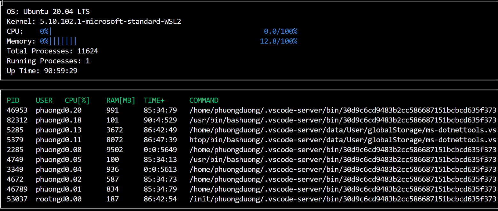

# System-Monitor

A system monitor application similar to htop! This app shows the system information and processes information

## Compiling and Running
This project requires ncurses for displaying outputs, install ncurses within your own Linux environment: `sudo apt install libncurses5-dev libncursesw5-dev`

1. Build the project: `make build`
2. Run executable: `./build/monitor`

## Credit

Starter code for System Monitor Project in the Object Oriented Programming Course of the [Udacity C++ Nanodegree Program](https://www.udacity.com/course/c-plus-plus-nanodegree--nd213).